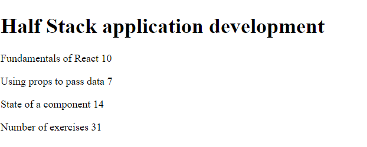
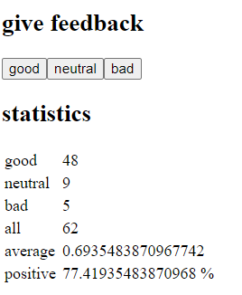
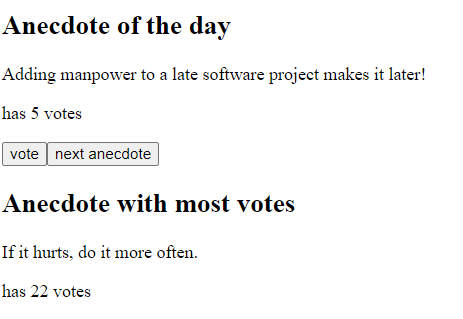
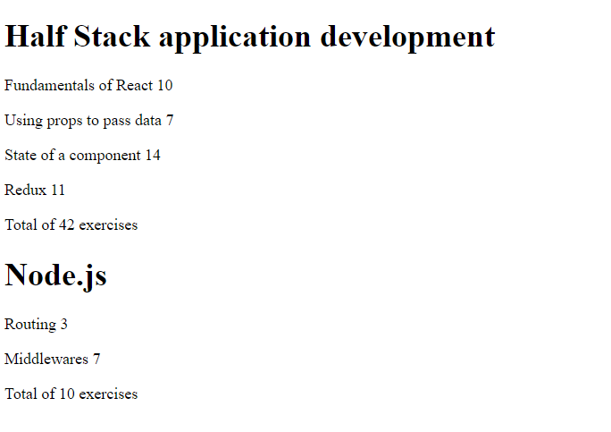
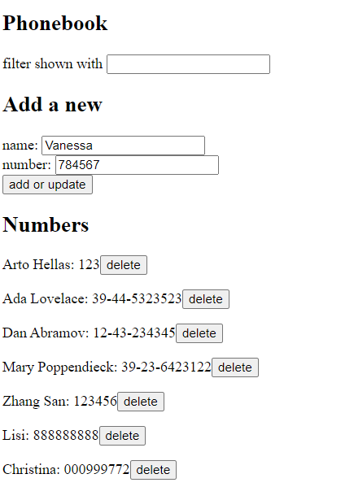
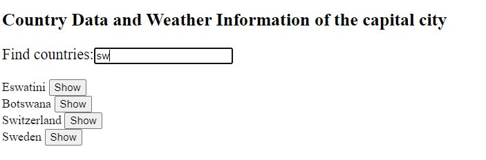
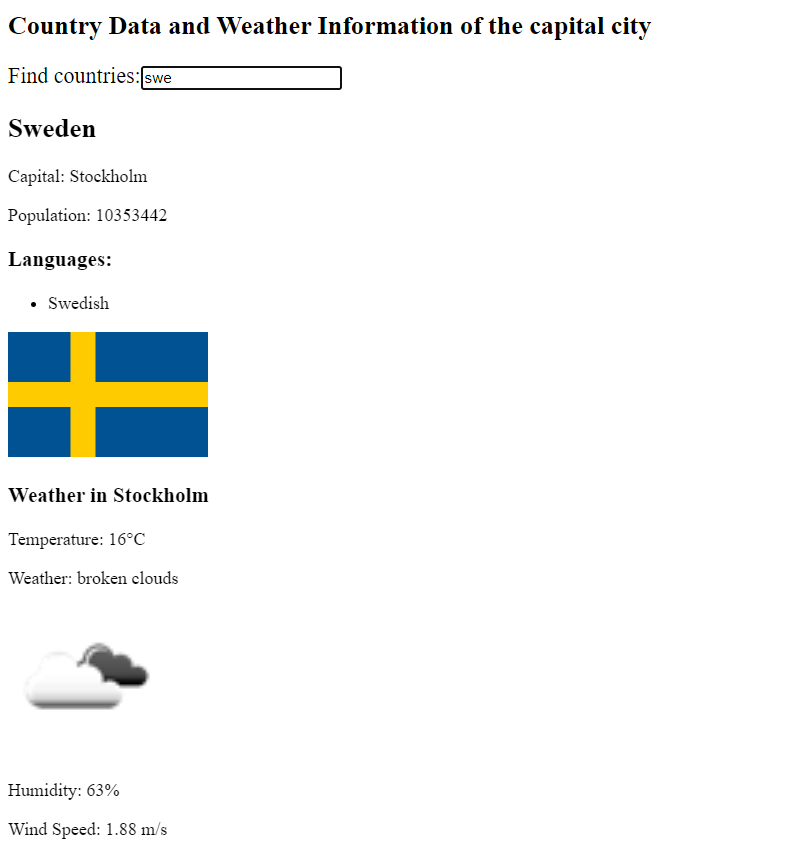

# Full Stack Open Projects

This repository collects a set of small projects built while working through Full Stack Open. Each project focuses on a specific set of fundamentals, from simple component rendering to data fetching and form-driven CRUD workflows.
Course Website: [https://fullstackopen.com/](https://fullstackopen.com/)
A standalone app developed during learning the course: [https://github.com/VikingCrusader/FSO-Notebook](https://github.com/VikingCrusader/FSO-Notebook)

# Part 1: Introduction to React

### 1. Courseinfo

**Date:** 2026.7.23 - 2026.7.24

Courseinfo is a compact React app that displays course details through reusable components. It is a good first step into breaking UI into smaller pieces and passing structured data through props.

The project focuses on component composition and rendering nested content cleanly. It keeps the interface simple so the core React patterns stay easy to see.

It will be improved in part 2.

### 2. Unicafe

**Date:** 2026.7.25

Unicafe is a feedback collection app that lets users submit ratings and see the results summarized on screen. It introduces state management and calculated statistics in a very small interface.

The project demonstrates how user input can drive live updates in the UI. It also shows how to keep presentation and logic separate while still staying lightweight.

### 3. Anecdotes

**Date:** 2026.7.25

Anecdotes is a small app for browsing short quotes and highlighting a random entry. It adds a bit more interactivity by combining buttons, state, and conditional rendering.

The project is a simple but useful exercise in updating state from different actions. It also demonstrates how to surface a featured item without making the interface complicated.

---

# Part 2: Communicating with server

### 4. Courseinfo Step 6-10

**Date:** 2026.7.26

This second version of Courseinfo expands on the original exercise with a more advanced component structure. It moves further into data modeling and more deliberate state handling.

The project shows how the same basic course display can evolve into a more organized solution. It is a useful checkpoint for comparing early component design with a more refined implementation.

### 5. Phonebook

**Date:** 2026.7.27 - 2026.8.2

Phonebook is a CRUD-style contacts app where users can add, filter, update, and remove entries. It is one of the more practical projects in the set because it connects the UI to persistent server data.

The project introduces asynchronous communication with a backend and more involved form logic. It also demonstrates notifications, filtering, and basic error handling in a real workflow.

### 6. CountryData

**Date:** 2026.8.3

CountryData is a search app for exploring countries and their details. It combines user-driven filtering with external data lookup to create a small but useful reference tool.

The project is a good example of wiring together multiple components and service calls around one search experience. It also shows how to reveal extra information only when a result is specific enough to be useful.
